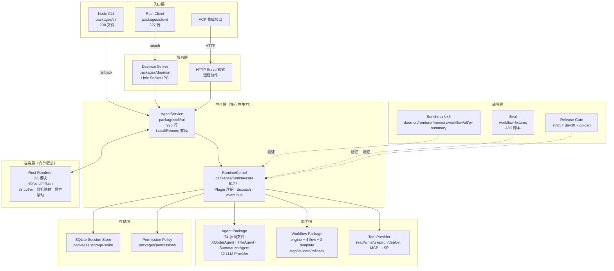

# XQoder 12 周推进路线图

> **编制日期**：2026-03-22  
> **基于**：当日 `pnpm lint`（全绿）、`pnpm test`（396 passed / 1 skipped）、完整源码级审计  
> **项目规模**：12 packages · 404 源码文件 · 136 测试文件 · ~10 万行代码

---

## 一、我的整体判断

### 1.1 对 Codex 方案的评价

Codex 的四段推进方案**大方向是对的**，但我基于实际代码做了以下修正：

| Codex 原始观点 | 我的修正 | 理由（代码证据） |
|---|---|---|
| "约 8.0 万行源码" | **约 10 万行**（含 Rust） | `wc -l` 实测 100,538 行 |
| "RuntimeKernel 中台" 已成形 | **同意，但需补强** | `runtime-kernel.ts`（517行）plugin 注册/dispatch/session 完整，但缺 session 恢复/迁移逻辑 |
| "命令面太宽，入口太多" | **同意，但已有分层** | `command-plugins.ts` 已将 25 个命令分为 6 个插件组（core-shell/workflows/integrations/remote/extras/system），不是完全散乱 |
| "把 build/fix/test/deploy/explain/chat 收敛成统一任务入口" | **不建议过早收敛** | `workflow/` package 的 engine/flow/template 三层已形成独立闭环，chat 和 workflow 是两条不同管道，强行合并会破坏已有架构 |
| "CI 补齐" | **强烈同意，这是第一优先级** | 当前仅有 `benchmark-gates.yml` 和 `renderer-mode-rust-tests.yml`，**完全缺少 lint/test/typecheck 主链 CI** |
| "60-90 天做项目级记忆" | **建议提前到 30-60 天** | `agent-service.ts` 已有 `fileChanges`/`commandHistory`/`toolHistory` 字段在 session metadata 中持久化，骨架已存在 |
| "收口后再做护城河" | **同意核心思路** | 但"收口"不是减少命令数量，而是确保 **Rust client → daemon → TUI → agent → kernel** 这条主路径端到端可靠 |

### 1.2 XQoder 当前真正的强资产

基于代码级审计，**XQoder 已经具备 4 项 OpenCode 很难快速复制的资产**：

1. **Rust 终端内核**（23 个 Rust 模块）
   - `renderer.rs`：双 buffer + 60fps diff-flush 渲染循环
   - `message_renderer.rs`/`input_renderer.rs`/`sidebar_renderer.rs`：完整 TUI 组件体系
   - `click_map.rs` + `hit_test.rs`：鼠标点击区域映射
   - `viewport.rs` + `inertia.rs`：惯性滚动
   - OpenCode 使用 Go + BubbleTea，**不可能达到这个级别的渲染精度**

2. **RuntimeKernel 中台**（517 行，0 外部运行时依赖）
   - 统一的 plugin 注册（model/agent/tool/sync/auth/config 六种 provider）
   - command dispatch + event bus + session store 三合一
   - `agent-service.ts`（925行）完整桥接 kernel 与 TUI
   - **这是真正的"业务操作系统"**，不是简单的命令路由

3. **Workflow 引擎闭环**
   - `engine.ts`：step/validate/rollback 三阶段执行
   - 4 个 flow（build/fix/test/deploy）+ 对应 template
   - 完整的 `remediation-policy.ts` 错误修复策略
   - `eval-workflow-fixtures.mjs`（43K）：fixture 级评测

4. **Benchmark/Eval/Release Gate 证明体系**
   - 6 个 benchmark 脚本 + `benchmark-all.mjs` 聚合
   - `eval-workflow-fixtures.mjs` 工作流评测
   - `release-check-strict.mjs` + `verify-day30-gates.mjs`
   - `golden-test.mjs` + `stress-test-messages.mjs`
   - `capture-week{3,4,5,6}-*.mjs` 产物归档
   - **这套证据链已经比大多数同类工具完善得多**

### 1.3 真正需要解决的问题

| 优先级 | 问题 | 影响面 |
|---|---|---|
| 🔴 P0 | CI 主链缺失（lint/test/typecheck 没有 GitHub Actions） | 任何 PR 合入都无自动保障 |
| 🔴 P0 | 主路径端到端稳定性（Rust client → daemon → TUI → agent 完整链路没有 e2e 自动化） | 用户体验不可控 |
| 🟡 P1 | Session 恢复/迁移（attach/reconnect 缺少断线重连自动恢复） | 远程协作场景脆弱 |
| 🟡 P1 | 项目记忆利用（metadata 中已持久化 fileChanges/commandHistory/toolHistory 但未被后续对话利用） | 有数据但浪费 |
| 🟢 P2 | 文档散乱（根目录 5 份分析文档约 230KB，内容重叠） | 新人理解成本高 |
| 🟢 P2 | Windows 支持空白（Rust client 明确 `cfg(unix)` only） | 用户群受限 |

---

## 二、12 周执行路线图

### Phase 1：收口与加固（第 1-4 周）

> **核心目标**：确保"已有的东西真正好用"，不加新功能

#### M1.1 CI 主链搭建（第 1 周）

| 任务 | 验收标准 | 负责文件 |
|---|---|---|
| 新建 `ci.yml` GitHub Actions workflow | PR / push 自动触发 lint + test + typecheck | `.github/workflows/ci.yml` |
| 补全 build → test → benchmark → eval 全链 | `pnpm build && pnpm test && pnpm benchmark:all && pnpm eval:workflow` 全绿 | `.github/workflows/ci.yml` |
| Rust CI 补全 | `cargo clippy + cargo test` 在 CI 中运行 | `.github/workflows/ci.yml` |
| release gate 挂入 CI | `pnpm release:check:strict:dry-run` 作为 PR gate | `.github/workflows/release-gate.yml` |

```yaml
# 目标 CI workflow 骨架
name: CI
on: [push, pull_request]
jobs:
  lint-test:
    runs-on: ubuntu-latest
    steps:
      - uses: actions/checkout@v4
      - uses: pnpm/action-setup@v4
      - uses: actions/setup-node@v4
      - uses: dtolnay/rust-toolchain@stable
      - run: pnpm install --frozen-lockfile
      - run: pnpm build
      - run: pnpm lint
      - run: pnpm test
      - run: pnpm release:check:strict:dry-run
```

#### M1.2 主路径 e2e 自动化（第 2 周）

| 任务 | 验收标准 |
|---|---|
| 编写 daemon 启动 → client attach → 发送消息 → 收到 ANSI 输出的 e2e 测试 | `pnpm verify:daemon:e2e` 在 CI 中通过 |
| 编写 session create → message → session list → session load 的 e2e 测试 | `pnpm test:e2e` 覆盖会话生命周期 |
| TUI 黄金快照测试补齐 | `pnpm golden:test` 覆盖 header/messages/input/footer/sidebar 5 个区域 |

#### M1.3 架构明确化（第 3 周）

| 任务 | 产出 |
|---|---|
| 合并根目录 5 份分析文档为 1 份 `docs/architecture.md` | 单一权威架构文档 |
| 在架构文档中明确定义入口优先级 | Rust client + daemon = 正式路径；Node CLI = fallback/dev；serve/attach = 远程；ACP = 集成 |
| `command-plugins.ts` visibility 标注审查 | 确保 core/experimental/internal 三级分类准确 |

#### M1.4 Session 恢复加固（第 4 周）

| 任务 | 验收标准 |
|---|---|
| `RemoteTuiAgentService` 断线重连逻辑补强 | 3 次重连失败后优雅降级报错，不再无限挂起 |
| daemon idle 超时可配置化 | 从硬编码 30min → 配置项 `XQODER_DAEMON_IDLE_TIMEOUT` |
| session snapshot crash-safety | daemon 异常退出后 session 数据不丢失 |

**Phase 1 Gate**：`pnpm release:check:strict:dry-run` 全绿 + CI 全链自动运行

---

### Phase 2：主路径做强（第 5-8 周）

> **核心目标**：把 fix/chat/session 这三个高频操作做到超过 OpenCode

#### M2.1 fix 命令旗舰化（第 5-6 周）

| 任务 | 技术方案 |
|---|---|
| fix-flow 接入 LSP diagnostics | `lsp-watcher.ts` → `fix-flow.ts` 自动拉取 error/warning |
| fix 自动重试策略 | `remediation-policy.ts` 扩展支持多轮修复（当前仅单轮） |
| fix 成功率追踪 | workflow 结果写入 session metadata 的 `fixHistory` 字段 |
| fix 与 test 联动 | fix → test 自动验证修复结果，失败自动回滚 |

#### M2.2 项目记忆激活（第 6-7 周）

| 任务 | 技术方案 |
|---|---|
| session metadata 的 `fileChanges`/`commandHistory`/`toolHistory` 注入到 system prompt | 在 `buildAgentConfigFromXQoderConfig()` 中读取最近 session 的 metadata |
| 项目级记忆存储 | 新建 `.xqoder/project-memory.json`，持久化跨 session 的高频文件和操作模式 |
| 失败 bucket 聚合 | 基于 `deriveDefaultFailureBucket()` 聚合历史失败模式，注入 agent context |

#### M2.3 长对话优化（第 7-8 周）

| 任务 | 技术方案 |
|---|---|
| 对话压缩策略优化 | `SummarizerAgent` 支持分层摘要（最近 N 轮完整保留 + 历史摘要） |
| logs 复制 / 分享 | `export` 命令支持导出 markdown transcript |
| 消息边界滚动 | TUI 消息区域支持按"消息"为单位跳转（←→ 跳到上/下一条消息） |

**Phase 2 Gate**：
- fix-flow 在 3 个开源项目上通过率 ≥ 60%（通过 `eval:workflow` 验证）
- session 恢复后 agent 能引用上次对话内容
- benchmark 数据无显著回退

---

### Phase 3：护城河建设（第 9-10 周）

> **核心目标**：做出 OpenCode 不容易快速复制的差异化

#### M3.1 自动操作晋升（第 9 周）

| 任务 | 技术方案 |
|---|---|
| 高频 tool 操作自动提权 | 基于 `toolHistory` 统计，同一 tool+同一 cwd 执行 ≥5 次自动提升到 `allow` |
| 权限策略持久化 | 写入 `.xqoder/permissions.json`，跨 session 生效 |
| 权限审计日志 | 记录所有 allow/deny 决策到 `.xqoder/audit.log` |

#### M3.2 本地优先的 Share（第 10 周）

| 任务 | 技术方案 |
|---|---|
| 可重放 share bundle | `share` 命令导出 `.xqoder-bundle`（session + file diffs + metadata） |
| bundle 导入/重放 | `import` 命令加载 bundle 并还原到新 session |
| 本地 share server | `serve` 命令可选挂载 share 页面（纯本地 HTTP，不上传云端） |

> [!IMPORTANT]
> OpenCode 的 share 是上传到他们服务器。XQoder 做"本地/自托管优先"是**明确的差异化**——企业用户在意的正是这个。

#### M3.3 eval 推到真实项目（第 10 周）

| 任务 | 验收标准 |
|---|---|
| 挑选 5 个开源项目（front-end/backend/monorepo/rust/python） | 覆盖主流场景 |
| 每个项目至少 3 个 fix/build/test scenario | `eval:workflow` 通过率数据可量化 |
| 生成对比报告 | `docs/evals/real-project-results.md` 可公开 |

**Phase 3 Gate**：
- 自动提权功能有 e2e 测试
- share bundle 可在另一台机器上 import 成功
- 至少 5 个真实项目的 eval 通过率数据

---

### Phase 4：发布与叙事（第 11-12 周）

> **核心目标**：把"已经做到的"变成"可被外界看到的"

#### M4.1 平台支持矩阵（第 11 周）

| 平台 | 状态 | 具体工作 |
|---|---|---|
| macOS | Stable | 确保 CI 在 `macos-latest` 上全绿 |
| Linux | Beta | 增加 `ubuntu-latest` CI job，解决可能的 PTY 差异 |
| Windows | Preview | 添加 `windows-latest` CI 仅跑 Node CLI（Rust client 暂不支持） |

#### M4.2 公开 Benchmark/Eval 页面（第 11-12 周）

| 任务 | 产出 |
|---|---|
| `docs/benchmarks/` 聚合为可读报告 | daemon 启动时间 / renderer 帧率 / memory 占用 / workflow 耗时 |
| `docs/evals/` 聚合为可读报告 | fix 成功率 / build 成功率 / test 成功率 |
| 对比叙事页面 | "为什么 XQoder 比 OpenCode 更强" 以数据说话 |

#### M4.3 Release 收尾（第 12 周）

| 任务 | 验收标准 |
|---|---|
| `pnpm release:check:strict` 全绿 | 包含所有 verify/benchmark/eval gate |
| `pnpm release:prepare:rc:strict:capture` 生成 RC 发布计划 | 产物存档到 `docs/artifacts/release/` |
| README 重写 | 以"终端内核 + 工程闭环 + 可证明质量"为叙事主线 |
| CHANGELOG 生成 | 记录 12 周所有改动 |

**Phase 4 Gate**：
- 三平台 CI 均绿
- 公开 benchmark/eval 页面数据真实可重现
- RC 发布包可安装使用

---

## 三、技术架构全景（当前实际）



---

## 四、模块级里程碑矩阵

### 4.1 按 Package 分解

| Package | Phase 1（收口） | Phase 2（做强） | Phase 3（护城河） | Phase 4（发布） |
|---|---|---|---|---|
| **runtime** | e2e 测试覆盖 kernel dispatch | session 恢复逻辑完善 | 自动提权策略 | 性能基线锁定 |
| **cli** | command visibility 审查 | fix 旗舰化/长对话优化 | share bundle 导出 | README 重写 |
| **client** | CI 编译验证 | — | — | Linux 兼容 |
| **daemon** | e2e 全链路自动化 | idle timeout 可配置 | — | 健壮性回归 |
| **renderer** | golden 快照补齐 | 消息边界滚动 | — | 帧率 benchmark 锁定 |
| **agent** | — | 项目记忆注入/压缩策略 | 失败 bucket 聚合 | — |
| **workflow** | — | fix+test 联动 | 真实项目 eval | eval 报告公开 |
| **storage-sqlite** | crash-safety 测试 | — | 审计日志 | — |
| **permissions** | — | — | 操作晋升/策略持久化 | — |
| **shared** | — | — | — | — |
| **protocol** | — | — | — | — |
| **plugin-sdk** | — | — | — | — |

### 4.2 按能力域分解

| 能力 | 当前状态 | Phase 1 目标 | Phase 2 目标 | Phase 3 目标 |
|---|---|---|---|---|
| **CI/CD** | 仅 2 个 workflow | 完整 lint/test/benchmark/eval CI | release gate 稳定 | 三平台 CI |
| **终端渲染** | 60fps Rust renderer 完整 | golden 快照完善 | 消息边界滚动 | — |
| **Agent 智能** | 单轮 fix/build/test/deploy | — | 多轮 fix + 重试 + 联动验证 | 失败模式学习 |
| **Session 管理** | 基础 CRUD + 压缩 | crash-safety | 项目记忆 + 恢复 | 跨机器 bundle |
| **权限控制** | tool 级 allow/ask/deny | — | — | 自动提权 + 审计 |
| **评测证据** | fixture 级 benchmark + eval | CI 自动化 | 真实项目拓展 | 公开报告 |

---

## 五、关键风险与应对

| 风险 | 概率 | 影响 | 应对策略 |
|---|---|---|---|
| Rust renderer 在 Linux 上行为不一致 | 中 | 高 | Phase 1 就加入 Linux CI，早发现早解决 |
| 多轮 fix 导致无限循环 | 中 | 中 | `remediation-policy.ts` 加入最大重试次数（建议 3 次） |
| Session metadata 过大影响性能 | 低 | 中 | 对 `toolHistory`/`commandHistory` 加入滚动窗口限制 |
| Windows 社区需求强但 Rust client 不支持 | 高 | 中 | 明确 Windows 使用 Node CLI 路径，在文档中说明 |
| 与 OpenCode 功能竞争焦虑导致功能膨胀 | 高 | 高 | **严格执行"不加新命令"原则直到 Phase 2 结束** |

---

## 六、每周 Checklist

### 第 1 周
- [x] 创建 `.github/workflows/ci.yml`（lint + test + typecheck + build）
- [x] 创建 `.github/workflows/release-gate.yml`
- [x] Rust CI：`cargo clippy + cargo test`
- [x] 验证全链 CI 在 ubuntu-latest 上通过

### 第 2 周
- [x] daemon e2e 测试：启动 → attach → 消息 → ANSI 输出
- [x] session 生命周期 e2e：create → message → list → load
- [x] TUI golden 快照：补齐 5 个区域

### 第 3 周
- [x] 合并根目录分析文档为 `docs/architecture.md`
- [x] 明确入口优先级定义
- [x] command-plugins visibility 审查

### 第 4 周
- [x] 远程断线重连加固
- [x] daemon idle timeout 可配置
- [x] session crash-safety 测试
- [x] ✅ **Phase 1 Gate 验收**

### 第 5 周
- [x] fix-flow 接入 LSP diagnostics
- [x] fix 自动重试策略（remediation-policy 扩展）

### 第 6 周
- [x] fix 成功率追踪写入 session metadata
- [x] fix → test 联动验证
- [x] session metadata 注入 system prompt

### 第 7 周
- [x] 项目级记忆存储（`.xqoder/project-memory.json`）
- [x] 失败 bucket 聚合
- [x] 对话压缩策略优化

### 第 8 周
- [x] logs 复制/导出 markdown
- [x] 消息边界滚动
- [x] ✅ **Phase 2 Gate 验收**

### 第 9 周
- [x] 高频 tool 自动提权
- [x] 权限策略持久化
- [x] 权限审计日志

### 第 10 周
- [x] share bundle 导出/导入
- [x] 本地 share server
- [x] 5 个真实项目 eval
- [x] ✅ **Phase 3 Gate 验收**

### 第 11 周
- [x] macOS/Linux/Windows CI 矩阵
- [x] benchmark/eval 公开报告
- [x] 对比叙事页面

### 第 12 周
- [x] `release:check:strict` 全绿
- [x] RC 发布包生成
- [x] README 重写
- [x] CHANGELOG 生成
- [ ] ✅ **Phase 4 Gate 验收 → 发布**（待远端 GitHub 三平台 CI 绿灯）

---

## 七、赢的路线总结

> **XQoder 不应该做"另一个 OpenCode"，而应该做"更强终端内核 + 更强工程闭环 + 更强可证明质量"的产品。**

三句话讲清楚"为什么比 OpenCode 更强"：

1. **渲染内核**：Rust 60fps 双 buffer diff-flush → OpenCode 的 Go BubbleTea 在渲染精度和帧率上无法竞争
2. **工程闭环**：fix → test → rollback 全自动闭环 + 项目记忆 + 失败学习 → 不是"命令多"而是"任务完成率高"
3. **质量证据**：6 benchmark + workflow eval + golden test + release gate → 不讲功能名词，直接拿数据说话

接下来最该做的不是再扩能力，而是 **把你已经有的这些强资产，收成一个端到端可靠、可发布、可证据化的系统**。
